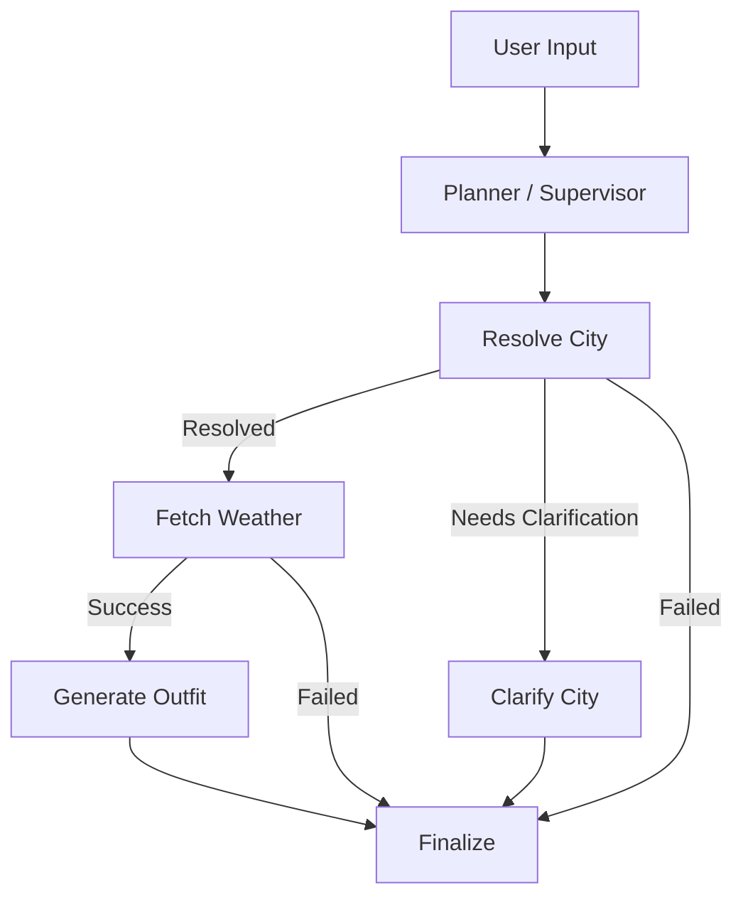

# FashionDailyDress

一个基于 `LangChain + LangGraph` 的多智能体天气穿搭项目。  
它不是单纯“查天气然后写几句建议”的 Demo，而是一个可讲清楚 **Agent 原理、Workflow 编排、Prompt/Context Engineering、多模型接入、人机澄清** 的简历项目雏形。

## 项目定位

这个项目面向两类目标：

1. 作为一个可运行的 AI Agent 应用  
   用户输入城市或自然语言需求，系统完成地点解析、天气查询、全天温差分析、穿搭建议生成和歧义澄清。

2. 作为一个适合放进 Agent 开发实习简历的项目  
   它重点体现：
   - Agent 实现原理
   - Workflow / 状态编排
   - Multi-Agent 协作
   - Prompt / Context Engineering
   - 主流大模型 API 接入方式

## 当前能力

- 支持中文、英文和中英混合地点输入
- 支持歧义城市澄清，例如 `springfield`
- 支持当前温度、体感温度、今日最高/最低温和全天温差
- 穿衣建议同时输出：
  - 分时段建议
  - 分层建议
- 支持快速路径与 Supervisor 路径切换
- 支持 Agent trace、模型名、fallback、耗时和工作流运行时展示

## 技术栈

- Python
- Gradio
- LangChain
- LangGraph
- OpenWeather API
- requests
- python-dotenv

## Agent Team 设计

当前主架构采用 `Supervisor + Specialist Team`，而不是开放式 swarm。

- `Supervisor / Planner`
  - 判断输入是否复杂
  - 决定是否走快路径
  - 为复杂自然语言输入生成结构化执行计划
- `City Resolver Agent`
  - 做地点标准化
  - 结合别名表、地理编码和 LLM 候选
  - 处理歧义城市
- `Weather Agent`
  - 查询天气
  - 聚合当前温度、体感温度、今日最高/最低温、当地时间
  - 处理天气 fallback
- `Fashion Agent`
  - 根据天气上下文生成分时段和分层穿搭建议
  - 在 LLM 失败时退回规则引擎
- `Human-in-the-loop`
  - 当城市歧义较强时要求用户确认候选

## Workflow



## 工作流说明

### 快速路径

对于简单城市输入，例如：

- `北京`
- `London`
- `伦敦 London`

系统优先走快路径：

1. 高频别名
2. 直接地理编码
3. 必要时才使用 LLM 做地点解析

### Supervisor 路径

对于复杂自然语言输入，例如：

- `帮我查今天东京天气并给穿搭`
- `明天北京适合怎么穿`

系统会让 `Supervisor` 先生成结构化执行计划，再进入 LangGraph 工作流。

## Prompt / Context Engineering

项目中的 Prompt 被拆成多层：

- Planner Prompt
- City Resolver Prompt
- Fashion Prompt

其中 Fashion Prompt 的上下文显式包含：

- 当前温度
- 体感温度
- 今日最高温
- 今日最低温
- 全天温差
- 湿度
- 风速
- 天气描述
- 天气数据时间
- 城市当地时间

这样可以比较清楚地展示你对 Prompt/Context Engineering 的理解，而不是“给模型一段模糊指令”。

## 多模型接入

默认通过 `langchain-openai` 的 `ChatOpenAI` 统一接入 OpenAI-compatible 接口。

这意味着你可以用同一套 provider 层切换：

- GPT 系列
- 通义千问兼容接口
- 智谱兼容接口
- 自建 OpenAI-compatible 网关

支持的环境变量：

```env
LLM_PROVIDER=openai_compatible
LLM_API_KEY=your_api_key
LLM_BASE_URL=your_base_url
LLM_MODEL_ID=your_model
LLM_TEMPERATURE=0.2
LLM_TIMEOUT_SECONDS=60

ALT_LLM_NAME=alternate
ALT_LLM_PROVIDER=openai_compatible
ALT_LLM_API_KEY=your_alt_api_key
ALT_LLM_BASE_URL=your_alt_base_url
ALT_LLM_MODEL_ID=your_alt_model
```

## 运行方式

### 1. 创建虚拟环境

```bash
py -3 -m venv .venv
```

### 2. 安装默认依赖

```bash
.\.venv\Scripts\python -m pip install -r requirements.txt
```

如果只想修 Web：

```bash
.\.venv\Scripts\python -m pip install -r requirements-web.txt
```

如果只想补 Agent / Workflow 运行时：

```bash
.\.venv\Scripts\python -m pip install -r requirements-agent.txt
```

如果需要 MCP：

```bash
.\.venv\Scripts\python -m pip install -r requirements-mcp.txt
```

### 3. 配置环境变量

复制 `.env.example` 后填写：

```env
LLM_PROVIDER=openai_compatible
LLM_API_KEY=your_llm_api_key
LLM_BASE_URL=your_llm_base_url
LLM_MODEL_ID=your_llm_model_id
OPENWEATHER_API_KEY=your_openweather_api_key
```

### 4. 环境体检

```bash
.\.venv\Scripts\python health_check.py
```

### 5. 启动 Web

```bash
.\.venv\Scripts\python gradio_app.py
```

### 6. 启动 CLI

```bash
.\.venv\Scripts\python simple_multi_agent.py
```

## 推荐验证场景

- `北京`
- `伦敦 London`
- `springfield`
- `图里河`
- `帮我查今天东京天气并给穿搭`

## 测试

```bash
.\.venv\Scripts\python -m unittest discover -s tests -v
```

## 项目亮点

如果你要把这个项目写进简历，推荐这样表述：

> 基于 LangChain + LangGraph 设计并实现多智能体天气穿搭系统，构建了 Supervisor + Specialist Team 工作流，支持城市解析、天气工具调用、歧义澄清和分时段/分层穿搭生成；实现了快路径与 LLM 规划路径切换、多模型 OpenAI-compatible 接入、Prompt/Context Engineering 和全链路 trace 展示。

你也可以压缩成更短版本：

> 使用 LangChain + LangGraph 实现多智能体天气穿搭应用，完成 Agent Team 编排、地点解析、人机澄清、多模型接入与 Prompt/Context 工程。

## 后续可继续强化的方向

- 接入 LangSmith / tracing 平台
- 增加真正可切换的多 provider UI
- 补充旅行规划 / 出行提醒等协作 agent
- 将 README 中的 “swarm” 作为二期实验设计加入
- 增加更完整的 benchmark 和 latency profiling
