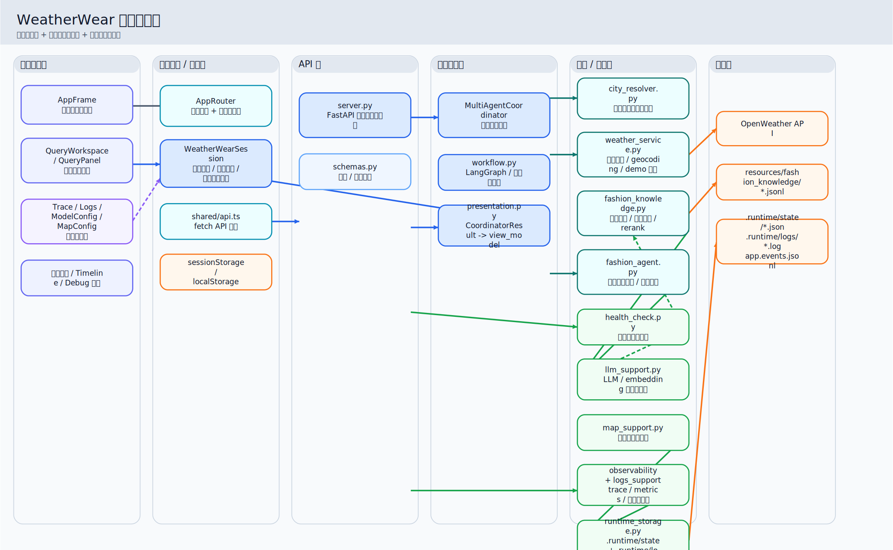
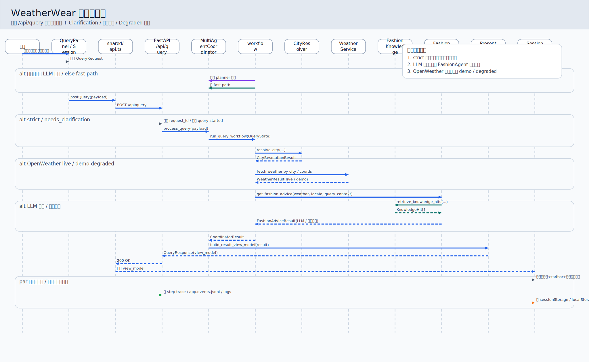
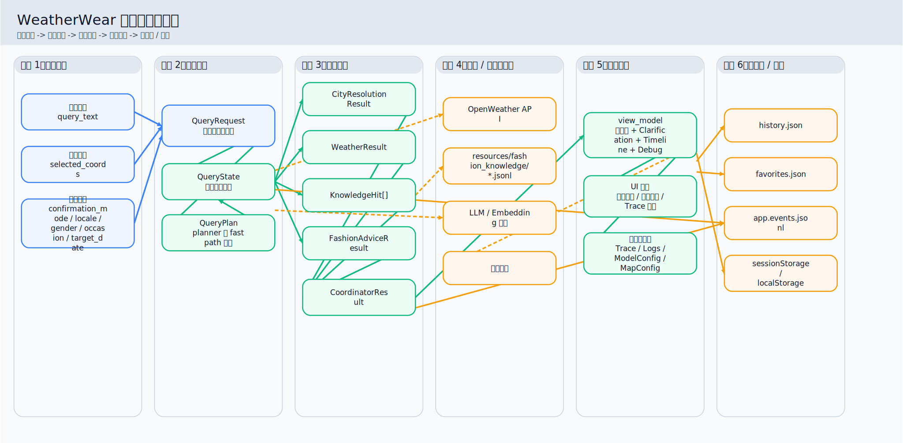
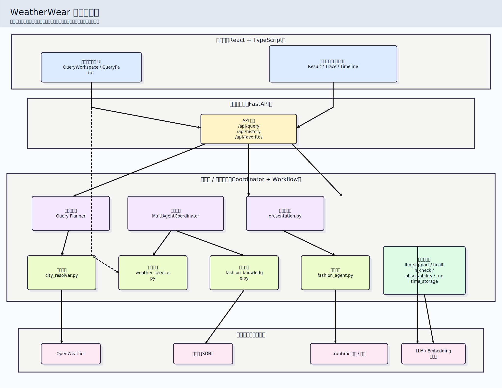
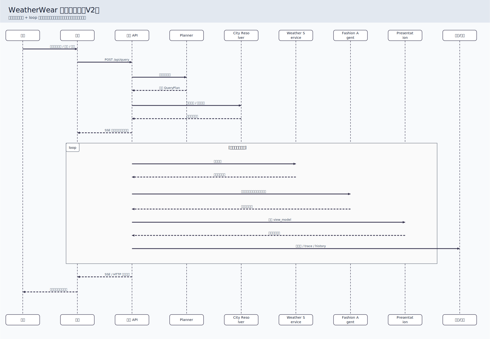
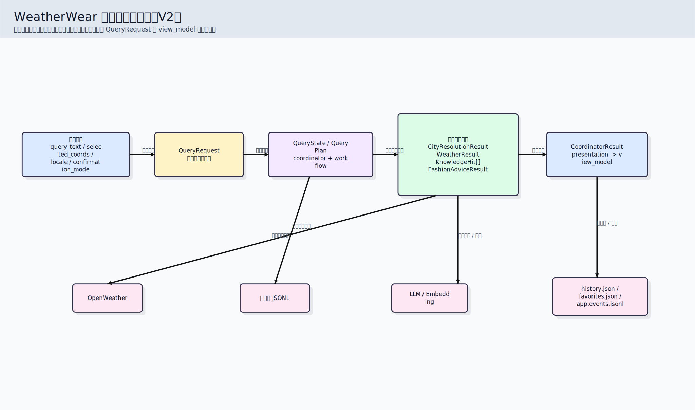

# WeatherWear 3.0

WeatherWear 3.0 是一个围绕“地点确认 -> 天气查询 -> 穿搭建议 -> 可观测执行链路”构建的 LLM 应用工程项目。  
它的重点不是做通用 Agent 平台，而是把一个真实可运行的天气穿搭应用打磨成：前后端完整、链路清晰、轻量 RAG 可验证、调试信息可追踪。

## 架构图示

- 图示说明文档：`docs/architecture-diagrams.md`
- 章节式架构文档：`docs/weatherwear-architecture/README.md`
- Mermaid 源文件：
  - `docs/diagrams/module-relationship.mmd`
  - `docs/diagrams/request-sequence.mmd`
  - `docs/diagrams/data-flow.mmd`
- 重新生成图：

```powershell
.\.venv\Scripts\python.exe scripts/generate_architecture_diagrams.py
```

- 导出素材：
  - `docs/assets/diagrams/module-relationship.svg`
  - `docs/assets/diagrams/request-sequence.svg`
  - `docs/assets/diagrams/data-flow.svg`
  - `docs/assets/diagrams/module-relationship.png`
  - `docs/assets/diagrams/request-sequence.png`
  - `docs/assets/diagrams/data-flow.png`

### 模块关系图



### 请求时序图



### 数据流转过程图



## 教材风格 V2 图

### 技术架构图（V2）



### 请求时序图（V2）



### 数据流转图（V2）



## 项目定位

- 面向用户：输入城市或地图选点，得到天气结果与穿搭建议
- 面向开发：可查看执行链路、模型配置、日志、系统状态、地图配置
- AI 能力边界：`workflow + 轻量 RAG + 代码编排式工具调用`
- 不做的事：开放式多轮 Agent、自主多工具 loop、独立 memory、真正 Multi-Agent 协作平台

## 核心功能

- 城市解析与候选地点确认
- OpenWeather 天气查询
- 结合场景/天气的穿搭建议生成
- 本地 JSONL 穿搭知识库检索
- 前端开发者工具页：
  - 模型配置
  - 地图配置
  - 系统状态
  - 日志
  - Trace / Timeline / Debug
- 中英文界面切换
- 历史记录与收藏地点

## 技术栈

### 技术栈总览表

| 技术域 | 技术 / 工具 | 在本项目中的作用 | 具体落点 |
|---|---|---|---|
| 前端框架 | `React 18` | 承载查询工作台、结果页、历史/收藏页、开发者页面等交互界面 | `frontend/src/app`、`frontend/src/features` |
| 前端语言 | `TypeScript` | 为前端状态、请求载荷、结果模型、地图坐标提供类型约束 | `frontend/src/shared/types.ts`、各 TS/TSX 文件 |
| 前端构建 | `Vite` | 提供本地开发服务器、构建和预览能力 | `frontend/package.json` |
| 前端路由 | `React Router DOM` | 管理查询页、历史页、收藏页、日志页、模型配置页、地图配置页等路由 | `frontend/src/app/AppRouter.tsx` |
| 前端服务端状态 | `@tanstack/react-query` | 统一管理查询请求、历史、收藏、runtime health、开发者会话、地图配置等异步状态 | `frontend/src/app/state/WeatherWearSession.tsx` |
| 国际化 | `i18next` / `react-i18next` | 支持中英文界面切换，让查询、结果、地图与开发者页文案按 locale 输出 | `frontend/src/i18n/index.ts` |
| 地图交互 | `Leaflet` / `react-leaflet` | 支持地图选点、位置展示、地图缩放与坐标交互 | `frontend/src/features/map/LocationMapCard.tsx` |
| 可选地图供应商 | `Baidu Map JS SDK`（可选） | 在百度地图模式下提供地图渲染、选点与搜索解析能力 | `frontend/src/features/map/BaiduMapFrame.tsx` |
| 样式系统 | `Tailwind CSS` | 快速构建页面布局、卡片、按钮、调试面板等样式 | `frontend/src/index.css` |
| CSS 工具链 | `PostCSS` / `Autoprefixer` | 支撑 Tailwind 编译和基础兼容处理 | `frontend/postcss.config.cjs` |
| 后端语言 | `Python` | 承载 API、workflow、天气服务、知识检索、穿搭生成、日志与运行时存储等逻辑 | `weatherwear/` |
| API 框架 | `FastAPI` | 提供 `/api/query`、历史、收藏、日志、模型配置、地图配置、健康检查等接口 | `weatherwear/api/server.py` |
| 数据模型 | `Pydantic v2` | 定义请求/响应契约并做参数校验 | `weatherwear/api/schemas.py` |
| API 运行 | `Uvicorn` | 启动并运行 FastAPI 服务 | `weatherwear/api/server.py` |
| 外部 HTTP 调用 | `requests` | 调用 OpenWeather 等外部 HTTP 服务 | `weatherwear/services/weather_service.py` |
| 环境配置 | `python-dotenv` | 从 `.env` 加载模型、天气、地图等配置项 | `weatherwear/support/llm_support.py`、`weatherwear/services/weather_service.py` |
| 类型兼容 | `typing_extensions` | 补充 Python 类型支持，服务于后端类型声明 | `requirements.txt` |
| 工作流编排 | `LangGraph` | 作为工作流运行时，把地点解析、天气查询、穿搭生成组织成图式执行链 | `weatherwear/application/workflow.py` |
| 模型调用抽象 | `LangChain` / `langchain-core` | 提供模型调用与消息组织的抽象层，但不负责整体业务架构编排 | `weatherwear/support/llm_support.py` |
| 模型 / Embedding 接入 | `langchain-openai` | 通过 OpenAI-compatible 协议接入 `ChatOpenAI` 与 `OpenAIEmbeddings` | `weatherwear/support/llm_support.py` |
| 向量检索 | `ChromaDB`（可选） | 作为穿搭知识库的向量检索后端；不可用时走降级路径 | `weatherwear/services/fashion_knowledge.py` |
| 本地知识库 | `JSONL` | 存储穿搭知识条目，支撑规则检索与轻量 RAG | `weatherwear/resources/fashion_knowledge/*.jsonl` |
| 外部天气服务 | `OpenWeather API` | 提供真实天气与地理编码结果，是天气事实来源 | `weatherwear/services/weather_service.py` |
| 模型服务 | `OpenAI-compatible LLM / Embedding Provider` | 提供 planner、穿搭建议生成与 embedding 能力 | `.env`、`weatherwear/support/llm_support.py` |
| 地图底图服务 | `OpenStreetMap` | 为 Leaflet 模式提供默认瓦片底图 | `.env.example`、前端地图配置 |
| 可选 MCP 集成 | `FastMCP`（可选） | 将天气查询能力暴露为 MCP 工具接口，不属于主查询链路强依赖 | `weatherwear/integrations/weather_mcp.py` |
| 前端测试 | `Vitest` | 运行前端组件与 hook 测试 | `frontend/package.json`、`frontend/src/test` |
| 前端交互测试 | `@testing-library/react` / `@testing-library/jest-dom` | 测试组件渲染、状态变化与交互表现 | `frontend/src/test` |
| 前端测试环境 | `jsdom` | 为前端测试提供浏览器 DOM 模拟环境 | `frontend/package.json` |
| 后端测试 | `unittest` / `fastapi.testclient` | 测试 API、协调器、天气服务、知识检索、表现层等模块 | `tests/` |
| 启动与运维脚本 | `PowerShell` | 负责前后端启动、端口探测、开发 PIN 生成、运行时文件管理 | `run_api.ps1`、`run_web.ps1`、`run_all.ps1` |
| 前端本地持久化 | `sessionStorage` / `localStorage` | 保存 locale、视图模式、最近结果与前端偏好 | `frontend/src/app/state/WeatherWearSession.tsx` |
| 运行时存储 | `.runtime` + `JSON / JSONL` | 落盘 history、favorites、日志、事件和运行状态 | `.runtime/`、`runtime_storage.py`、`user_state_store.py` |

### 前端

- `React 18`
- `TypeScript`
- `Vite`
- `React Router`
- `@tanstack/react-query`
- `i18next` / `react-i18next`
- `Leaflet` / `react-leaflet`
- `Tailwind CSS`
- `Vitest`

### 后端

- `FastAPI`
- `Pydantic`
- `Uvicorn`
- `requests`
- `python-dotenv`

### AI / 检索

- `LangChain`
- `LangGraph`（可选运行时）
- 本地 `JSONL` 穿搭知识库
- `Chroma`（可选向量索引）
- 本地持久化向量缓存（Chroma 不可用时的降级路径）

### 可选集成

- `Baidu Map JS SDK`
- `MCP`（按需安装 `requirements-mcp.txt`）

## 简历版项目命名

如果这个项目在简历里只保留一版项目表述，建议统一命名为：

**`WeatherWear｜可观测工作流式天气穿搭 LLM 应用`**

推荐原因：

- 能准确体现这是一个**单场景 LLM 应用工程项目**
- 能突出 `workflow + 轻量 RAG + 可观测性` 三个真实亮点
- 不会把项目误包装成“通用 Agent 平台”或“多智能体协作系统”

## 目录说明

```text
frontend/                         React 前端
scripts/                          开发与知识库辅助脚本
tests/                            Python 测试
docs/                             架构、评测与知识库维护说明
weatherwear/
  api/                            FastAPI 接口
  application/                    coordinator / workflow / presentation
  domain/                         核心类型定义
  resources/                      地点别名、评测样例与穿搭知识库
  services/                       天气、地点、穿搭、知识检索服务
  support/                        配置、日志、健康检查、运行时存储
run_all.ps1                       单窗口启动前后端
run_all_dev.ps1                   双窗口开发模式
run_api.ps1                       单独启动 API
run_web.ps1                       单独启动前端
stop_all.ps1                      停止后台进程
```

## 本地运行

### 推荐启动方式（GitHub 访问者优先）

安装完 Python 与前端依赖后，推荐直接使用跨平台统一启动入口：

```powershell
.\.venv\Scripts\python.exe scripts/dev_up.py
```

如果你当前环境使用的是 `python` 命令，也可以运行：

```bash
python scripts/dev_up.py
```

停止命令：

```powershell
.\.venv\Scripts\python.exe scripts/dev_down.py
```

说明：

- 未配置 `OPENWEATHER_API_KEY` 时，系统仍可启动，但天气会走 `demo / degraded`
- 未完整配置 LLM 时，planner、穿搭生成或 embedding 可能走兜底逻辑
- 启动器会输出前端地址、API 地址、当前运行模式和开发者 PIN
- Windows 用户仍然可以继续使用 `run_all.ps1 / run_all_dev.ps1`

### 1. 安装 Python 依赖

```powershell
py -3 -m venv .venv
.\.venv\Scripts\python.exe -m pip install -r requirements.txt
```

如果你需要 MCP：

```powershell
.\.venv\Scripts\python.exe -m pip install -r requirements-mcp.txt
```

### 2. 安装前端依赖

```powershell
cd frontend
npm install
cd ..
```

### 3. 配置环境变量

复制 `.env.example` 为 `.env`，至少补齐：

```env
LLM_API_KEY=
LLM_BASE_URL=
LLM_MODEL_ID=
OPENWEATHER_API_KEY=
```

如果不配置 embedding，系统仍可运行，只是知识检索会停留在规则检索模式。

### 4. 启动项目

#### 单窗口模式

```powershell
.\run_all.ps1
```

特点：

- 自动启动后端和前端
- 自动探测可用端口
- 日志写入 `.runtime/logs/`
- 启动时生成本地开发者 PIN
- 默认自动打开浏览器

不自动打开浏览器：

```powershell
$env:WEATHERWEAR_SKIP_BROWSER="1"
.\run_all.ps1
```

停止后台进程：

```powershell
.\stop_all.ps1
```

#### 开发模式

```powershell
.\run_all_dev.ps1
```

特点：

- API 和前端分别在两个 PowerShell 窗口启动
- 更适合实时看日志和调试

#### 分别启动

```powershell
.\run_api.ps1
.\run_web.ps1
```

## 发布前自检

推荐在推到 GitHub 前运行一次：

```powershell
.\.venv\Scripts\python.exe scripts/validate_project.py
```

## 默认端口与运行时文件

- 前端默认起在 `http://127.0.0.1:5173`
- API 默认起在 `http://127.0.0.1:8000`
- 若端口被占用，启动脚本会自动选择空闲端口
- 运行时目录：`.runtime/`
- 日志目录：`.runtime/logs/`
- 结构化事件日志：`.runtime/logs/app.events.jsonl`

## 开发者 PIN

- 访问 `/dev/*` 页面前需要先解锁开发者会话
- PIN 由启动脚本在本地生成
- 启动完成后终端会打印当前 PIN

## 核心链路

```text
/api/query
  -> coordinator.process_query
  -> city resolution
  -> weather service
  -> fashion_knowledge.retrieve_knowledge_hits
  -> fashion_agent
  -> presentation.build_result_view_model
  -> frontend session state / result UI
```

对应关键文件：

- `weatherwear/api/server.py`
- `weatherwear/application/coordinator.py`
- `weatherwear/application/workflow.py`
- `weatherwear/application/presentation.py`
- `weatherwear/services/city_resolver.py`
- `weatherwear/services/weather_service.py`
- `weatherwear/services/fashion_agent.py`
- `weatherwear/services/fashion_knowledge.py`
- `frontend/src/app/state/WeatherWearSession.tsx`

## 轻量 RAG 实现说明

- 知识源：`weatherwear/resources/fashion_knowledge/zh-CN.jsonl` 和 `weatherwear/resources/fashion_knowledge/en-US.jsonl`
- 检索输入：天气数值、天气现象、场景描述、标签、性别、locale
- 检索方式：
  - 规则检索
  - 向量检索（优先 Chroma）
  - Chroma 不可用时回退到本地向量缓存
  - embedding 未配置时回退到纯规则检索
- 输出位置：
  - 用户结果页中的知识依据
  - 开发者页中的 Debug / Timeline / Logs

## 调试与知识库辅助脚本

### 离线检索评测

```powershell
.\.venv\Scripts\python.exe scripts/evaluate_retrieval.py --pretty
```

使用自定义评测样例：

```powershell
.\.venv\Scripts\python.exe scripts/evaluate_retrieval.py `
  --cases weatherwear/resources/evaluation/retrieval_cases.sample.json `
  --pretty `
  --fail-on-check
```

写出 JSON 结果，便于归档或贴到作品集说明里：

```powershell
.\.venv\Scripts\python.exe scripts/evaluate_retrieval.py `
  --cases weatherwear/resources/evaluation/retrieval_cases.sample.json `
  --output .runtime/retrieval-eval.json
```

评测 case 支持在样例里写：

- `weather`
- `query_context`
- `expected_any_hit_ids`
- `expected_top_hit_ids`
- `expected_retrieval_mode`
- `expected_vector_leg_status`

### 知识库校验 / 摘要 / 索引重建

```powershell
.\.venv\Scripts\python.exe scripts/check_fashion_knowledge.py
.\.venv\Scripts\python.exe scripts/check_fashion_knowledge.py --rebuild-index
.\.venv\Scripts\python.exe scripts/check_fashion_knowledge.py --rebuild-index --force
```

### 知识库导入 / 规范化写回

仅做预检，不落盘：

```powershell
.\.venv\Scripts\python.exe scripts/import_fashion_knowledge.py `
  --input weatherwear/resources/examples/fashion_knowledge_import.sample.json `
  --locale en-US `
  --validate-only
```

写入新的 JSONL 文件：

```powershell
.\.venv\Scripts\python.exe scripts/import_fashion_knowledge.py `
  --input your_entries.json `
  --output .runtime/normalized-fashion-knowledge.jsonl `
  --locale en-US
```

向现有 locale 知识库追加导入：

```powershell
.\.venv\Scripts\python.exe scripts/import_fashion_knowledge.py `
  --input your_entries.json `
  --locale en-US `
  --append
```

这个脚本会自动做：

- 字段 trim / 去空白
- `category` / `occasion_hints` / `gender_compatibility` 规范化
- 列表去重
- `weather_conditions` / `structured_guidance` 结构校验
- 重复 id、重复内容签名、跨 locale 对齐相关检查

### 推荐的知识库治理顺序

1. 先跑 `scripts/import_fashion_knowledge.py --validate-only`
2. 再跑 `scripts/check_fashion_knowledge.py`
3. 如需向量缓存同步，再跑 `scripts/check_fashion_knowledge.py --rebuild-index`
4. 最后跑 `scripts/evaluate_retrieval.py --cases weatherwear/resources/evaluation/retrieval_cases.sample.json --pretty`

## 项目验收

### 最小验收命令

```powershell
.\.venv\Scripts\python.exe scripts/validate_project.py
```

这条命令会依次执行：

- 核心 Python 单测
- 知识库校验
- 离线检索评测
- 前端生产构建

### 成功标准

- 所有 step 都返回 `PASS`
- 最终 summary 中 `failed=0`
- 会生成验收报告：`.runtime/validation-report.json`

验收脚本现在会同时产出两层结果：
- 控制台里的简要 summary，适合快速判断是否通过
- `.runtime/validation-report.json` 中的完整结构化结果，适合归档和排查

### 常见失败原因

- embedding 模型不可用：此时可能退回 `rules_only`，只要评测 expectation 通过，仍属于可接受结果
- 本地 npm 缓存权限异常：可重试构建，或清理缓存后再跑
- 知识库条目变更后未重建索引：先跑 `scripts/check_fashion_knowledge.py --rebuild-index`

## 测试

### Python

```powershell
.\.venv\Scripts\python.exe -m unittest discover -s tests -v
```

### 前端

```powershell
cd frontend
npm test
npm run build
```

## 作品集 / 面试可讲证据

- 检索评测样例：`weatherwear/resources/evaluation/retrieval_cases.sample.json`
- 检索评测样例已包含 `en-US` / `zh-CN` 对齐 case，可直接做双 locale 回归
- 知识库导入样例：`weatherwear/resources/examples/fashion_knowledge_import.sample.json`
- 统一验收入口：`scripts/validate_project.py`
- 架构说明：`docs/architecture-overview.md`
- 检索评测说明：`docs/retrieval-evaluation.md`
- 知识库维护说明：`docs/knowledge-base-maintenance.md`
- 开发者工具页可展示：
  - `Trace / Timeline / Debug`
  - `Model Config`
  - `Map Config`
  - `System Status`
  - `Logs`

## 新人接手建议阅读顺序

1. 先看 `README.md` 或 `README.zh-CN.md`，明确项目定位和能力边界
2. 再看 `weatherwear/api/server.py`，理解接口入口
3. 再看 `weatherwear/application/coordinator.py`，理解主协调链路
4. 再看 `weatherwear/application/workflow.py`，理解执行编排
5. 再看 `weatherwear/services/fashion_knowledge.py` 和 `weatherwear/services/fashion_agent.py`
6. 最后看 `weatherwear/application/presentation.py` 和前端 `frontend/src/app/state/WeatherWearSession.tsx`

## 能力边界说明

- 已实现：
  - 单应用场景下的 LLM 工作流编排
  - 轻量 RAG
  - 可观测执行链路
  - 代码编排式“工具调用”
- 部分实现：
  - LangGraph 兼容运行时
  - 向量检索与混合检索降级链路
- 未实现：
  - 通用 Agent 平台
  - 真正 Multi-Agent 协作
  - 开放式多轮自主规划
  - 独立 Agent Memory / 学习机制 / 在线反馈闭环
