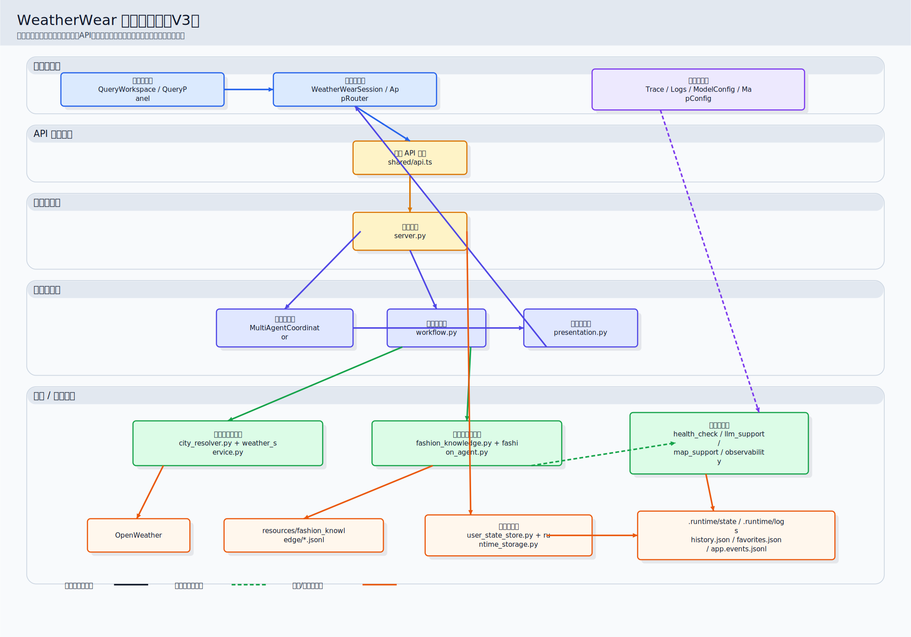
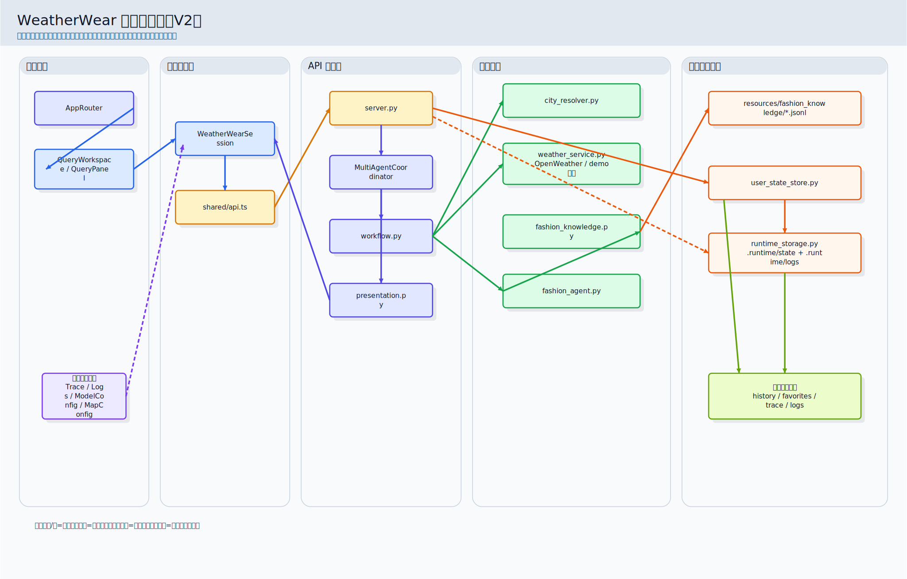
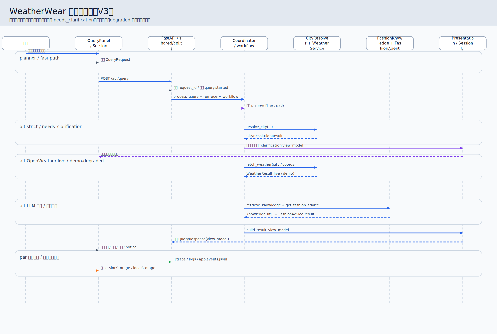
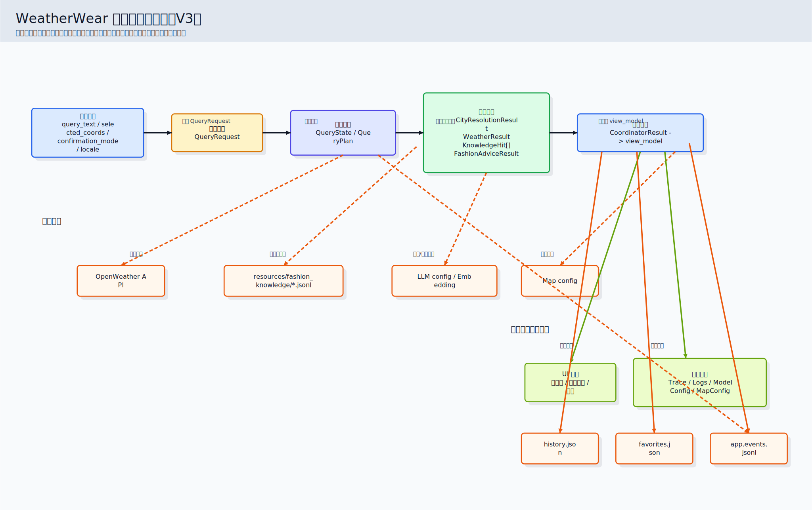

# WeatherWear 图谱导航

本文统一整理 WeatherWear 当前可用的架构图、时序图、数据流图与评审文档。

## 推荐阅读顺序

1. 先看 V3 技术架构图，快速建立整体分层认知。
2. 再看 V3 模块关系图，理解关键代码模块如何依赖。
3. 然后看 V3 请求时序图，理解 `/api/query` 主成功链路。
4. 最后看 V3 数据流转过程图，理解对象如何从输入变成 `view_model`。

## V3 汇报版图谱

### 1. 技术架构图

- 图源：`docs/diagrams/architecture-layered-v3.mmd`
- 成品：`docs/assets/diagrams/architecture-layered-v3.svg`、`docs/assets/diagrams/architecture-layered-v3.png`
- 作用：适合汇报、培训、项目 first look，回答“系统分几层、主链怎么走”。

### 2. 模块关系图

- 图源：`docs/diagrams/module-relationship-v2.mmd`
- 成品：`docs/assets/diagrams/module-relationship-v2.svg`、`docs/assets/diagrams/module-relationship-v2.png`
- 作用：适合工程接手，回答“关键代码模块分别在哪里、彼此依赖什么”。

### 3. 请求时序图

- 图源：`docs/diagrams/request-sequence-v3.mmd`
- 成品：`docs/assets/diagrams/request-sequence-v3.svg`、`docs/assets/diagrams/request-sequence-v3.png`
- 作用：适合讲解一次 `/api/query` 正常成功链路与三个关键分支。

### 4. 数据流转过程图

- 图源：`docs/diagrams/data-flow-v3.mmd`
- 成品：`docs/assets/diagrams/data-flow-v3.svg`、`docs/assets/diagrams/data-flow-v3.png`
- 作用：适合回答“输入对象、中间状态、领域结果、页面模型和持久化之间如何变形”。

## 当前成品评审

- 评审文档：`docs/weatherwear-architecture/diagram-review.md`
- 内容范围：现有 6 张旧版成品图的定位、优点、混乱点与 V3 取舍策略。

## 历史版本保留说明

以下旧版文件全部保留，用作历史留存和细节参考，不被新版覆盖：

- `docs/diagrams/module-relationship.mmd`
- `docs/diagrams/request-sequence.mmd`
- `docs/diagrams/data-flow.mmd`
- `docs/diagrams/architecture-layered-v2.mmd`
- `docs/diagrams/request-sequence-v2.mmd`
- `docs/diagrams/data-flow-v2.mmd`
- `docs/assets/diagrams/module-relationship.svg`
- `docs/assets/diagrams/request-sequence.svg`
- `docs/assets/diagrams/data-flow.svg`
- `docs/assets/diagrams/architecture-layered-v2.svg`
- `docs/assets/diagrams/request-sequence-v2.svg`
- `docs/assets/diagrams/data-flow-v2.svg`

## 代码事实锚点

新版图命名与主事实对齐以下入口：

- `weatherwear/api/server.py`
- `weatherwear/application/coordinator.py`
- `weatherwear/application/workflow.py`
- `weatherwear/application/presentation.py`
- `frontend/src/app/state/WeatherWearSession.tsx`
- `frontend/src/shared/api.ts`
