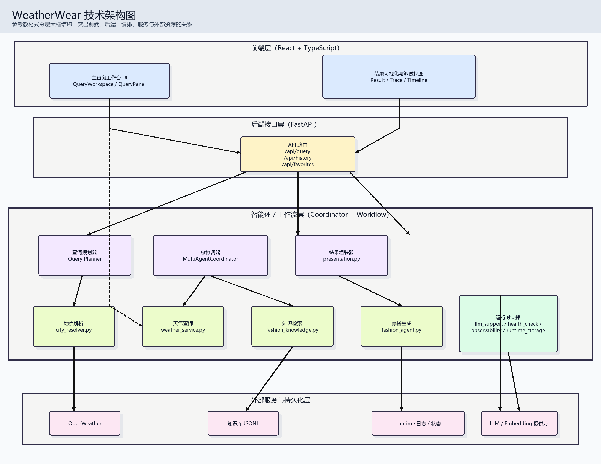
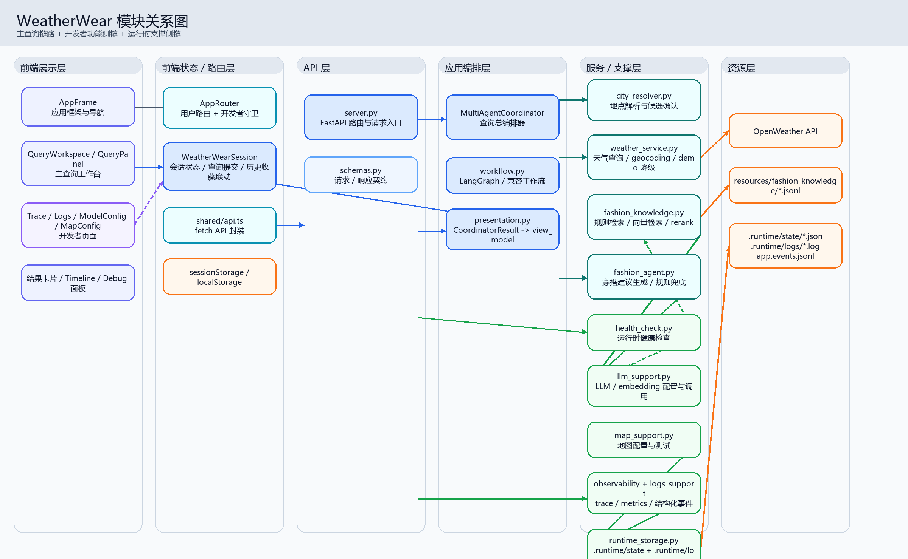
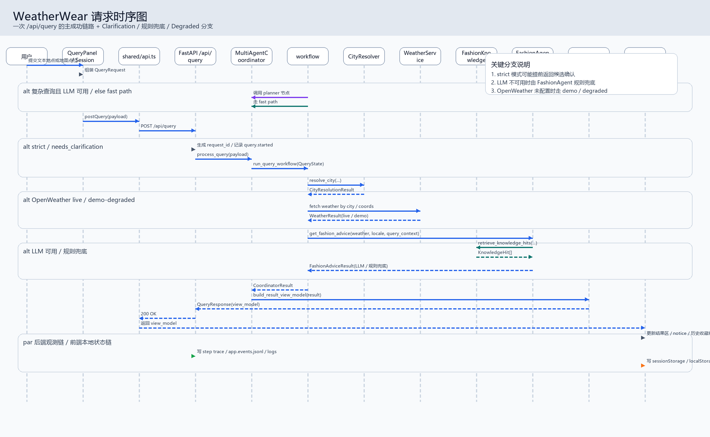
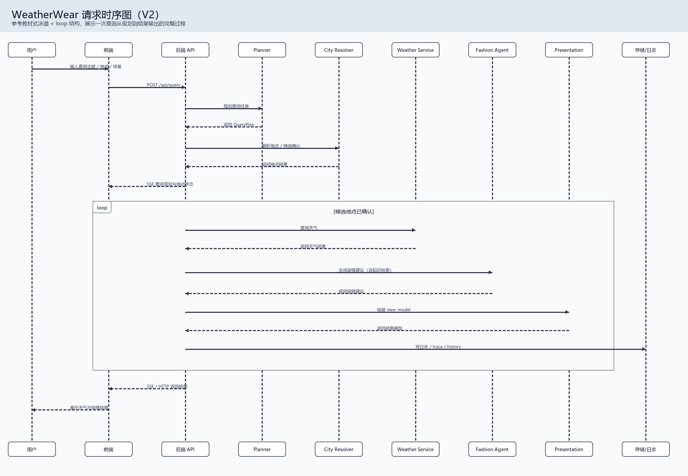
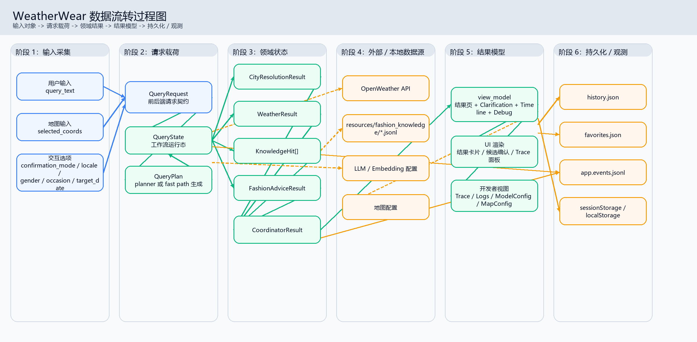
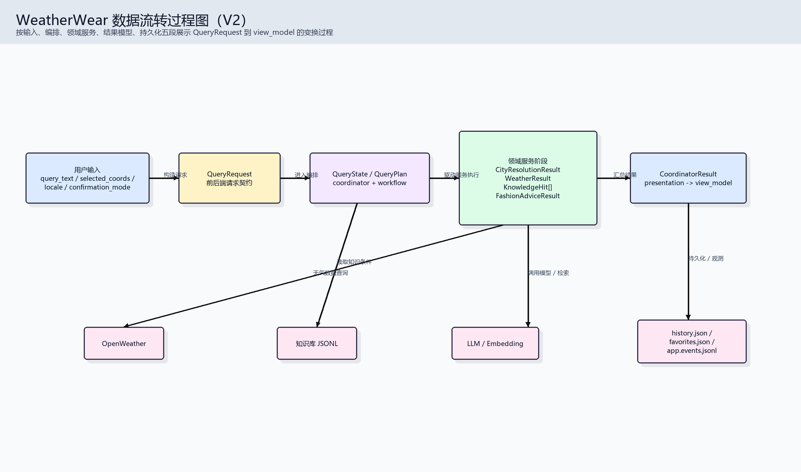

# WeatherWear 图谱成品评审

本文只分析**当前已经产出的图片成品**，重点看 PNG / SVG 的阅读体验，而不是只看 Mermaid 源码。

## 评审范围

- `docs/assets/diagrams/architecture-layered-v2.png`
- `docs/assets/diagrams/module-relationship.png`
- `docs/assets/diagrams/request-sequence.png`
- `docs/assets/diagrams/request-sequence-v2.png`
- `docs/assets/diagrams/data-flow.png`
- `docs/assets/diagrams/data-flow-v2.png`

---

## 1. `architecture-layered-v2`

- **当前定位**：偏汇报视角的技术架构图，强调“前端 → API → 编排层 → 服务层 → 资源层”的大框分层。
- **优点**：层次边界清楚；比工程版模块图更适合 first look；整体配色克制，适合放进汇报材料。
- **主要混乱点**：`API 路由`节点向下同时发散到多个方向，视觉中心过于拥挤；`Support` 聚合过大，语义杂糅；箭头没有明显区分主调用、配置依赖和落盘关系。
- **新版继承 / 取舍策略**：保留“大框分层”的汇报风格，但把主链收敛成单线；把支撑能力拆成“运行时支撑”和“状态持久化”两类；增加图例，降低蜘蛛网感。

## 2. `module-relationship`

- **当前定位**：工程内部视角最强的模块关系图，尽量完整地覆盖前端、API、应用编排、服务层与资源层。
- **优点**：代码模块覆盖面最全；模块名和代码文件名贴合度高；适合工程接手时按模块查找代码。
- **主要混乱点**：节点数量偏多，右侧服务层过长；跨列长连线较多，视觉重心右倾；第一次阅读时很难快速区分“主链”和“侧链”。
- **新版继承 / 取舍策略**：保留关键模块名，但把图定位明确为“工程接手图”；只保留主调用链、落盘链、开发者侧链 3 类关系；压缩为 15 个左右核心节点。

## 3. `request-sequence`

- **当前定位**：完整表达主查询流程的工程版时序图，突出内部节点和多种分支。
- **优点**：信息完整；对 `clarification / 规则兜底 / degraded` 三类分支都有交代；与后端代码模块对应较紧。
- **主要混乱点**：参与者过多，横向跨度太大；注释框和分支框一起占空间，主成功链路不够聚焦；更像内部推演图，不像汇报图。
- **新版继承 / 取舍策略**：保留关键分支事实，但压缩泳道数量；只突出一次成功请求的主链，把分支缩成局部 `alt` 区块，不再让注释挤压主体。

## 4. `request-sequence-v2`

- **当前定位**：更接近教材插图风格的时序图，用 `loop` 结构说明“候选地点确认后再继续执行”。
- **优点**：泳道式结构整齐；风格上比工程版更适合放进 PPT；能看出“确认地点后进入主链”的意图。
- **主要混乱点**：文字偏小，留白偏大；参与者仍然偏多，导致主线过长；`loop` 大框把注意力分散到版式本身，而不是业务链本身。
- **新版继承 / 取舍策略**：保留“汇报友好”的版式取向，但进一步合并泳道；把 `loop` 换成更紧凑的分支框和阶段框，避免大面积空框。

## 5. `data-flow`

- **当前定位**：最完整的数据流转图，强调对象在 6 个阶段中的变形和沉淀。
- **优点**：阶段思路正确；数据对象命名完整；能回答“数据从哪里来、最后落到哪里去”的问题。
- **主要混乱点**：六列过宽，箭头数量较多；领域对象发散后再汇总，中心区域较拥挤；结果模型、调试视图、持久化同时展开，信息密度过高。
- **新版继承 / 取舍策略**：保留“按对象变形讲故事”的方法，但把主链收缩到 5 段以内；把外部依赖收拢为数据源池，把消费端收拢为结果下游。

## 6. `data-flow-v2`

- **当前定位**：面向汇报的简化版数据流图，突出 `QueryRequest → QueryState/Plan → 领域阶段 → view_model`。
- **优点**：主链最清楚；节点最少；很适合在几秒钟内讲清整体变换方向。
- **主要混乱点**：领域阶段被压成黑盒，解释力不足；数据源与主链的关系较弱；结果消费端没有展开，无法支撑“页面 / 调试 / 落盘”三个去向。
- **新版继承 / 取舍策略**：把它作为 V3 基底，保持主链线性，同时补回最必要的数据对象与消费端信息，不再过度简化。

---

## 结论

- 现有 6 张图里，`architecture-layered-v2` 与 `data-flow-v2` 更适合作为汇报底稿。
- `module-relationship` 与 `request-sequence` 保留了关键代码事实，但首读成本偏高。
- 新版 V3 的重构方向应统一为：**减少节点、减少跨列长箭头、强化主链、弱化次要分支、统一配色与图例**。
